# Video Playback ES System

## Functional Requirements

-   User select any video
-   User plays the video
-   Commands are: Continue, Pause, Forward, Back, Stop
-   Track events per user per video.
-   Auto-generate events (Continue, Stop) based on time or progress.
-   Allow multiple users watching multiple videos concurrently.
-   Store and process user events.

## Non-Functional Requirements

-   Auto-scaling triggered by total user
-   Auto-scaling triggered by RAM/CPU usage of 50-70%
-   Each video played by a user is run on 1 worker thread
-   Maximum concurrent video being watched on a single instance is 20 videos

## Architecture Design

### Architecture

```mermaid
architecture-beta
    group registry(disk)[OCI Image Registry]
    group infra(cloud)[Infrastructure]
    group node(logos:kubernetes)[Nodes] in infra

    service client(logos:postman-icon)[Client]

    service reg(logos:docker-icon)[BE App Image] in registry
    service metrics(disk)[Metrics] in infra
    service scale(cloud)[Horizontal Pod Auto Scaler] in infra
    service deploy(logos:kubernetes)[Deployment] in node
    service collector(disk)[Metrics Collector] in node
    collector:R--L:metrics
    metrics:B--T:scale
    scale:L--R:deploy
    deploy:B--T:reg

    service gateway(internet)[Gateway] in infra
    service svc(logos:kubernetes)[Service] in node
    junction j1 in node
    service pod1(server)[Pod 1] in node
    service pod2(server)[Pod 2] in node
    service pod3(server)[Pod N] in node

    service svc2(logos:kubernetes)[Service] in node
    service redis(database)[Redis] in node
    service deploy2(logos:kubernetes)[Deployment] in node

    client:R--L:gateway
    gateway:T--L:svc
    svc:R--L:j1
    j1:R--L:pod1
    j1:T--L:pod2
    j1:B--L:pod3
    svc2:B--T:redis
    gateway:R--L:svc2


```

